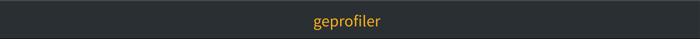

[Geprofiler](https://github.com/phamtrongngh/geprofiler) is a Python call stack profiler built on top of [Pyinstrument](https://github.com/joerick/pyinstrument) but stripped of the unnecessary and focused on supporting features for HTTP Server.

# Installation

```
$ pip install geprofiler
```

> [Geprofiler](https://github.com/phamtrongngh/geprofiler) supports Python 3.7+. In addition, [curl](https://curl.se/) is required to be installed if you want to use `geprofiler.yaml`.

# Usage

The examples below use [Django](https://www.djangoproject.com/) to create a simple HTTP server that will be profiled by [Geprofiler](https://github.com/phamtrongngh/geprofiler).

## ⚡ Quick start

To profile [Django](https://www.djangoproject.com/) web requests:

-   Add `geprofiler.middleware.ProfilerMiddleware` to `MIDDLEWARE` in your `settings.py`.
-   Once the server has been started, add `?geprofiler` (as a query param) to the end of a request URL you want to profile (also `geprofiler` can also be added as a header). As soon as the request is processed, a new browser tab will be opened to display the profile information.
    
-   Add `GEPROFILER_PROFILE_DIR = 'profiles'` to your `settings.py` if you want the result page to be saved to the folder `profiles` in your working directory.

---

## 📋 Use `geprofiler.yaml`

Sometimes, you need a different solution to solve advanced problems. For example, you might want Geprofiler to automatically profile all the APIs you specified immediately, instead of spending too much time profiling each API manually. In this case, you can define a file `geprofiler.yaml` in your working directory with a structure similar to the one below.


> -   `request`:
>     -   `format`: the format of your request list.
>     -   `list`: a list of request statements corresponding to the format declared above.
>     -   `filter`:
>         -   `min_duration`: the minimum duration that a request has taken in milliseconds.
> -   `output_dir`: (optional) the folder that you want to save the result page in.

Finally, to start profiling, run:  
```
$ geprofiler
```
Result:
